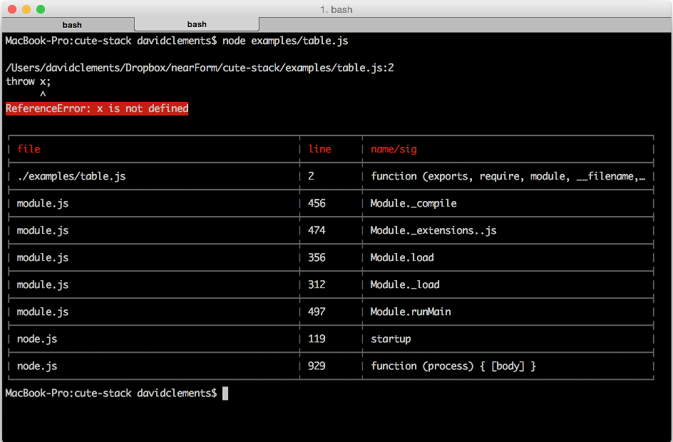

<!--
master: title-page
-->

# Title
## Subtitle

---
<!--
master: bullets
-->

# Bullets

* Body Level One
  * Body Level Two
    * Body Level Three
      * Body Level Four
        * Body Level Five

---
<!--
master: command-bullets
-->

# Command bullets

```sh
$ shell command
```

* Body Level One
  * Body Level Two
    * Body Level Three
      * Body Level Four
        * Body Level Five

---
<!--
master: command-command-bullets
-->

# Command-command bullets

```sh
$ shell command
```
```sh
$ shell command
```
* Body Level One
  * Body Level Two
    * Body Level Three
      * Body Level Four
        * Body Level Five
---
<!--
master: command-bullets-command
-->

# Command-bullets-command

```sh
$ shell command
```
* Body Level One
  * Body Level Two
    * Body Level Three
      * Body Level Four
        * Body Level Five

```sh
$ shell command
```


---
<!--
master: command-command-command-bullets
-->

# 3-command bullets

```sh
$ shell command
```
```sh
$ shell command
```
```sh
$ shell command
```
* Body Level One
  * Body Level Two
    * Body Level Three
      * Body Level Four
        * Body Level Five


---
<!--
master: command-command-command-command-bullets
-->

# 4-command bullets

```sh
$ shell command
```
```sh
$ shell command
```
```sh
$ shell command
```
```sh
$ shell command
```
* Body Level One
  * Body Level Two
    * Body Level Three
      * Body Level Four

---
<!--
master: image
-->

# image slide



---
<!--
master: image-caption
-->

# image with caption

<figure>
  
  <figcaption>
    image caption
  </figcaption>
</figure>

---
<!--
master: image-bullets
-->

# image with bullets


* Body Level One
  * Body Level Two
    * Body Level Three
      * Body Level Four
        * Body Level Five

---
<!--
master: code
-->

# code slide

```javascript
function someCode() {
  
  console.log('that is multiline');
  console.log('and verbose');
 
}
```


---
<!--
master: code-caption
-->

# code with caption

Caption here
```javascript
function someCode() {
  
  console.log('that is multiline');
  console.log('and verbose');
 
}
```

---
<!--
master: code-bullets
-->

# code with bullets

```javascript
function someCode() {
  
  console.log('that is multiline');
  console.log('and verbose');
 
}
```

* Body Level One
  * Body Level Two
    * Body Level Three
      * Body Level Four
        * Body Level Five
---
<!--
master: bullets-code
-->

# bullets with code

* Body Level One
  * Body Level Two
    * Body Level Three
      * Body Level Four
        * Body Level Five

```javascript
function someCode() {
  
  console.log('that is multiline');
  console.log('and verbose');
 
}
```

---
<!--
master: code-snippet-bullets
-->

# code snippet and bullets

```javascript
console.log('small amount of code');
```

* Body Level One
  * Body Level Two
    * Body Level Three
      * Body Level Four
        * Body Level Five

---
<!--
master: code-snippet-bullets-command
-->

# snippet, bullets, command

```javascript
console.log('small amount of code');
```

* Body Level One
  * Body Level Two
    * Body Level Three
      * Body Level Four

```sh
$ shell command
```

---
<!--
master: code-command
-->

# code command

```javascript
function someCode() {
  
  console.log('that is multiline');
  console.log('and verbose');
 
}
```

```sh
$ shell command
```

---
<!--
master: code-command-command
-->

# code command command

```javascript
function someCode() {
  
  console.log('that is multiline');
  console.log('and verbose');
 
}
```

```sh
$ shell command
```

```sh
$ shell command
```

---

<!--
master: quote
-->

# quote
<blockquote>
quote
</blockquote>


---

<!--
master: quote-quote
-->

# double quote
<blockquote>
  quote
</blockquote>
<blockquote>
  quote
</blockquote>

